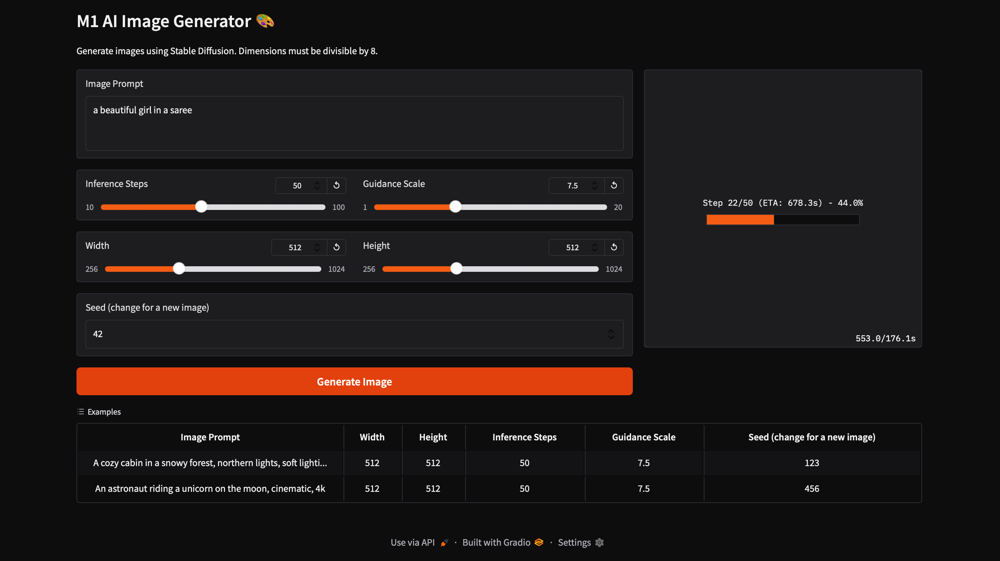
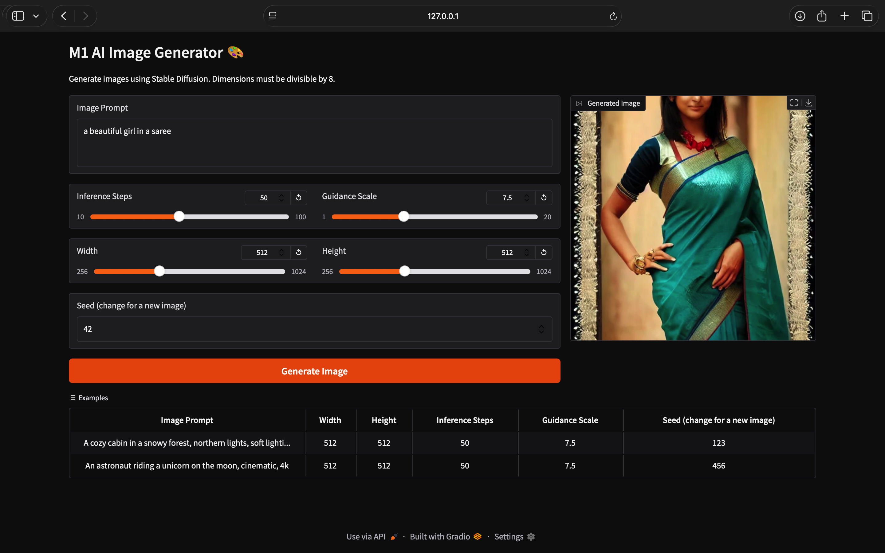

# M1 AI Image Generator 🎨

A simple, user-friendly web application to generate images from text prompts using the Stable Diffusion model. This project is optimized to run locally on Apple Silicon (M1/M2) Macs, using a Gradio web interface.

![Screenshot of the Gradio App]




---

## Features
- **Web Interface**: Easy-to-use UI built with Gradio.
- **Live Progress**: A real-time progress bar with ETA shows you how long the generation will take.
- **Customizable**: Adjust image dimensions, inference steps, and guidance scale. (if you have a stronger GPU than apple M1 then you can move the slider to a better resolution else let it be 512x512 for a M1 GPU)
- **Optimized for M1**: Uses the `mps` device for GPU acceleration on Apple Silicon.

---

## Setup and Installation

Follow these steps to run the project locally.

1.  **Clone the repository:**
    ```bash
    git clone [https://github.com/shukla0075/ai-image-generator-m1.git](https://github.com/shukla0075/ai-image-generator-m1.git)
    cd ai-image-generator-m1
    ```

2.  **Create and activate a Python 3.11 virtual environment:**
    ```bash
    python3.11 -m venv venv
    source venv/bin/activate
    ```

3.  **Install the required libraries:**
    ```bash
    pip install -r requirements.txt
    ```

4.  **Run the application:**
    ```bash
    python app.py
    ```

Now, open your web browser and go to the local URL provided (usually `http://127.0.0.1:7860`).

---

## Usage

1.  Type your desired image description into the **Prompt** text box.
2.  Adjust the sliders for **Width**, **Height**, **Steps**, and **Guidance** as needed.
3.  Click the **Generate Image** button.
4.  Wait for the progress bar to complete. Your generated image will appear on the right.